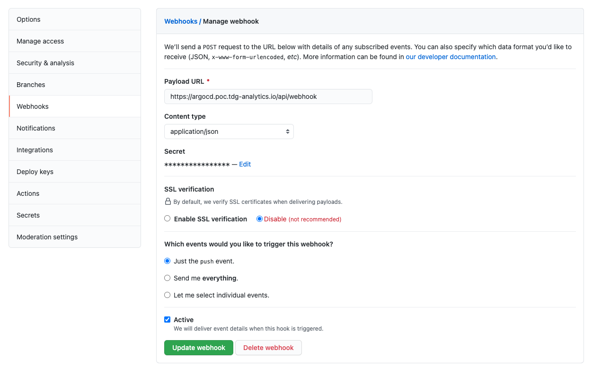
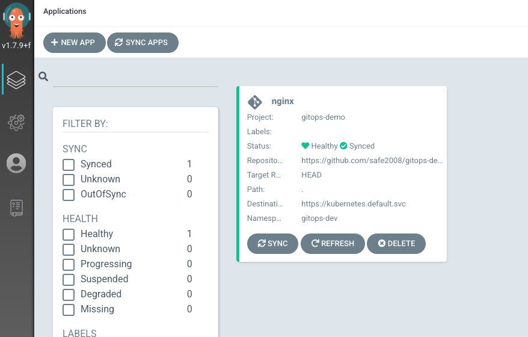

# gitops-demo

```bash
## https://argoproj.github.io/argo-cd/operator-manual/webhook/
## https://github.com/safe2008/gitops-demo/settings/hooks/265962989

❯ kubectl get secret argocd-secret -n argocd
❯ kubectl describe secrets/argocd-secret -n argocd
❯ kubectl get secret argocd-secret  -o jsonpath='{.data}' -n argocd

```



```bash
## https://argoproj.github.io/argo-cd/operator-manual/declarative-setup/#app-of-apps
❯ kubectl apply -n argocd -f argo-resource/dev-nginx.yaml

```


